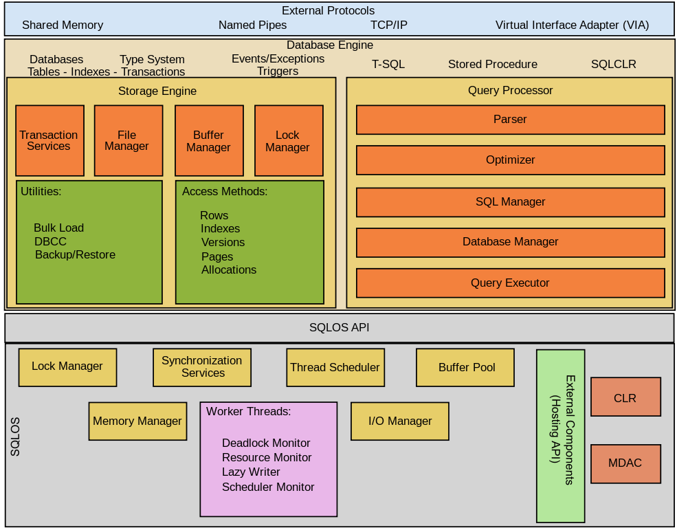

# SQL Server (T-SQL)

_This repository is part of a cloud data engineering roadmap for hands-on practice with Microsoft SQL Server and T-SQL._

## What is SQL Server?

SQL Server is a relational database management system (RDBMS) developed by Microsoft.  
It uses SQL for querying data and T-SQL (Transact-SQL) for SQL Server-specific features such as variables, control flow, and procedural logic.

## SQL Server Architecture

SQL Server mainly has two core components:

- **Database Engine**
  - The main component of SQL Server.
  - Includes:
    - **Relational Engine**: Processes queries and creates execution plans.
    - **Storage Engine**: Manages data files, pages, indexes, and transactions.
  - Supports database objects like tables, views, stored procedures, and triggers.

- **SQLOS (SQL Server Operating System)**
  - A lower-level layer that supports the database engine.
  - Handles memory management, I/O operations, scheduling, synchronization, and exception handling.

## Other SQL Server Tools

- **SSMS**: SQL Server Management Studio, used for development and administration.
- **SSIS**: SQL Server Integration Services, used for data integration and ETL.
- **SSAS**: SQL Server Analysis Services, used for analytical models and OLAP.
- **SSRS**: SQL Server Reporting Services, used for building and sharing reports.

_For data engineers, SSMS and SSIS are especially important._

## SQL Server Editions

- **Developer Edition**: Full-featured edition for development and testing (not for production).
- **Express Edition**: Free, lightweight edition for small workloads (up to 10 GB per database).
- **Standard Edition**: Suitable for most business applications with some resource limits.
- **Web Edition**: Cost-effective edition designed for web hosting environments.

## Quick Summary

- SQL Server is a Microsoft RDBMS that uses SQL and T-SQL.
- Its architecture is built around the Database Engine and SQLOS.
- It provides tools for development, integration, analysis, and reporting.
- Different editions support different use cases and scale requirements.

